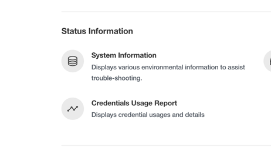

Enhanced Credentials Plugin
===========================

This plugin enables below features for Credentials,

- Credential Access Filtering
- Credential Usage Reporting

# Credential Access Filtering

This feature enables defining rules for allowing/blocking access to the credentials from the Projects/Jobs/Items.

## Credentials Access Filtering Rule

When a credential is accessed by a Project/Job/Item, this plugin interferes and follow the below logic,

1. Loops in all the Credential Rule Definitions
2. Checks if the ID of the credential, which is being accessed, matches with the ```credentialPattern``` value of any
   rule.
    1. If there is match, checks if the Project/Job/Item name matches with the ```itemPattern``` value of the rule which
       has matched on the previous step.
        1. If there is match, returns True to the controller method where credential access is allowed.
        2. If there is no match, return False to the controller method where credential access is blocked.
    2. If there is no match, allows/blocks access depending on the Default Restriction Mode

### Rule Definition

Credential Rule has three properties which must be set during the definition.

```Rule Name```: Name of the rule.
```Credential Pattern```: Regex Pattern for Credentials.
```Item Pattern```: Regex Pattern for Project/Jobs/Items.

### Default Restriction Mode

Plugin has a default behavior setting which decides on allowing/blocking access to the credentials if there are any
matches or not.

- ```Restrict access if a credential is not matched with one of the defined patterns```

  Restrict access to a credential if the credential ID does not match with any of the defined rules. With this behaviour
  all access to all credentials will be blocked unless a defined rule matches.

- ```Do not restrict access if a credential is not matched with one of the defined patterns```

  Allow access to the credential if the credential does not match with any of the defined rules. With this behaviour
  access will be blocked only for the credentials which matching with a rule.

## Credentials Access Filtering Definition

For defining Credential Access Rules please follow the below steps

1. Navigate to "Manage Credential Rules" section under "Manage Jenkins" as shown below

   

2. Set the default Restriction Mode as shown below

   

3. Define rules as many as you need. An example definition is shown below

   

4. Save your changes.

## Configuration As Code

Credential Rule definitions can be defined by using Jenkins Configuration as Code approach.

You can use the below definition on the root level of the Jenkins CASC file.

```yaml
credentialRules:
  restrictNotMatching: true/false
  <Rule Name 1>:
    credentialPattern: "<Regex Pattern>"
    itemPattern: "<Regex Pattern>"
  <Rule Name 2>:
    credentialPattern: "<Regex Pattern>"
    itemPattern: "<Regex Pattern>"
```

An example definition can be found below,

```yaml
credentialRules:
  restrictNotMatching: true
  rule1:
    credentialPattern: "kubernetes.*"
    itemPattern: "kubernetes_deployments.*"
```

# Credential Usage Reporting

This feature enables reporting Credential Usage with the below details,

- Total Usage Count: Total number of accesses for each credential.
- Project/Job/Item Usage Count: Total number of credential access grouped by Project/Job/Item.
- Node Usage Count: Total number of credential access grouped by Nodes.

For accessing usage report please follow the below steps

1. Navigate to "Credentials Usage Report" section under "Manage Jenkins" as shown below

   